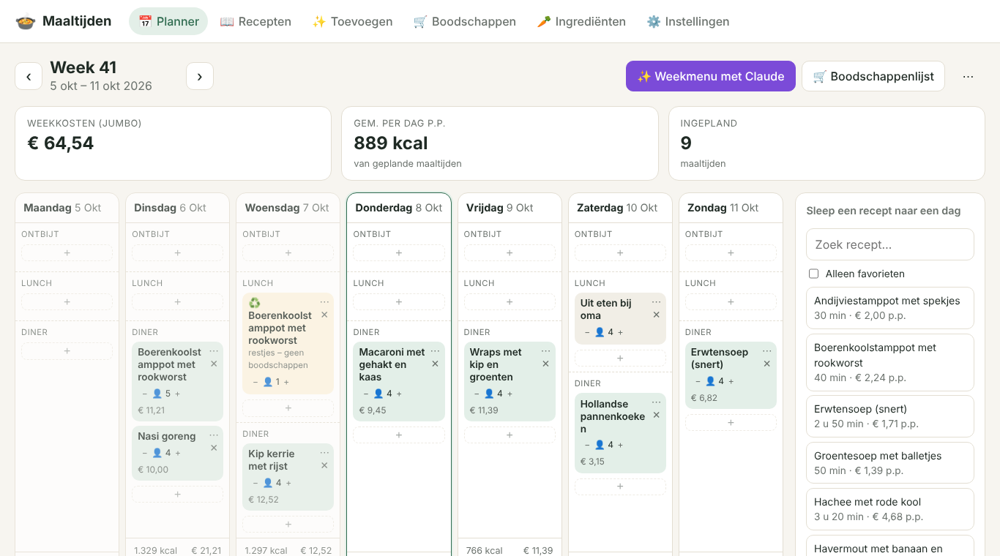
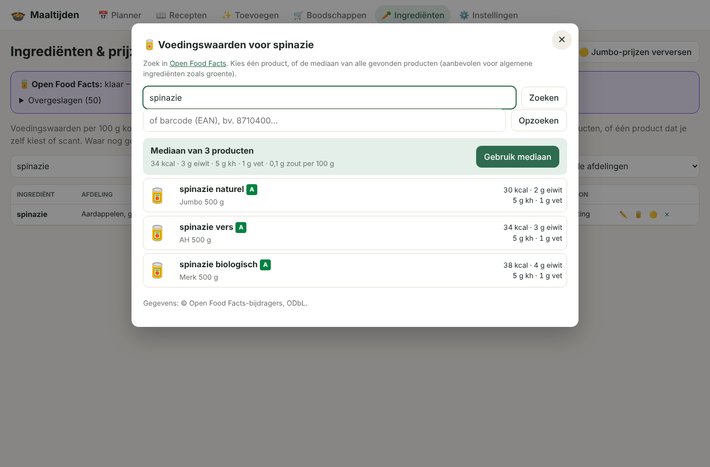
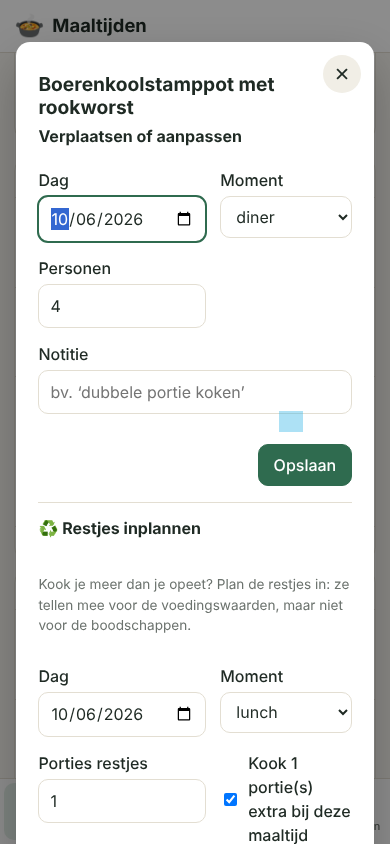
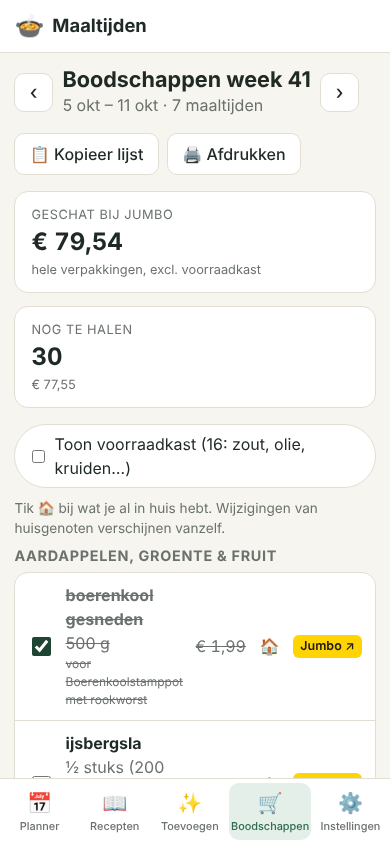
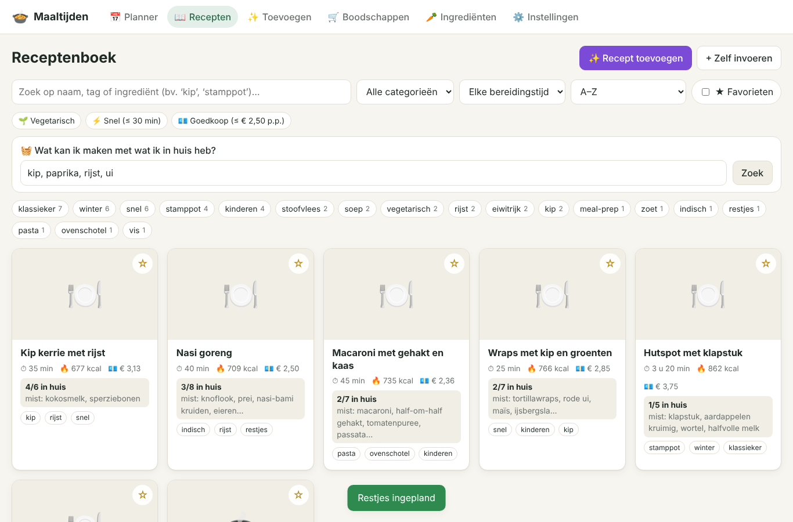
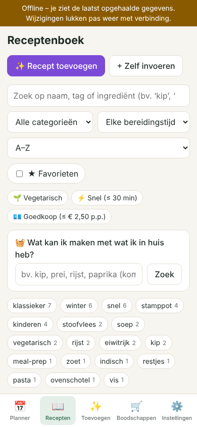
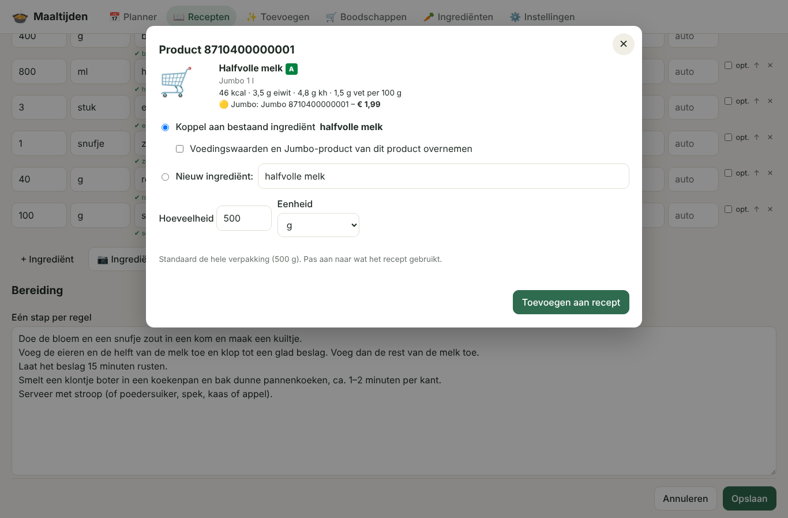
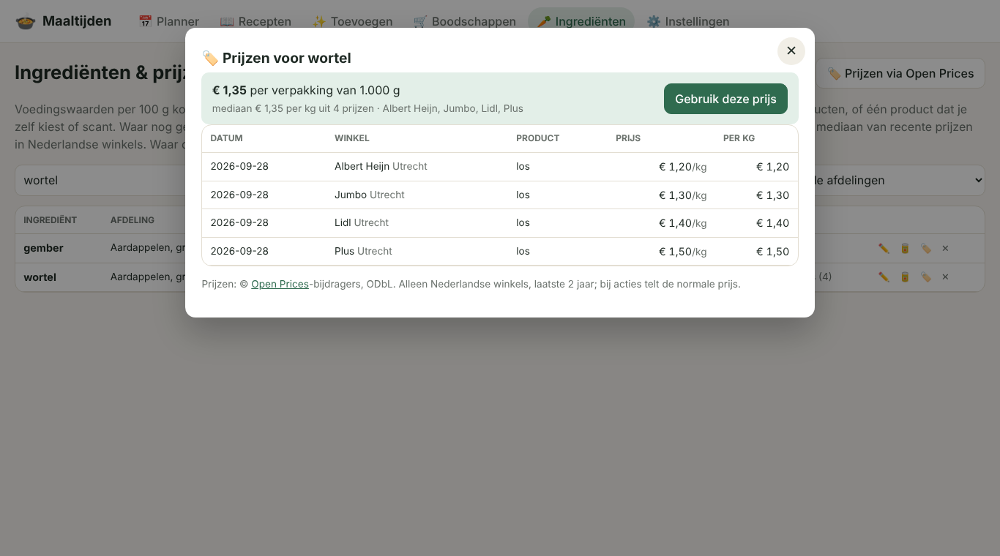

# Gebruikersacceptatietest (UAT): Maaltijden-app v1 → v2.3

**Datum:** 8 oktober 2026
**Getest:** v1.0 (eerste versie), v2.0, v2.2 (barcode scannen; Jumbo-koppeling verwijderd) en v2.3 (prijzen uit Open Prices)
**Uitslag v2.3:** 22 van de 22 scenario's geslaagd ✅

## 1. Aanpak

1. **Verwachtingen verzamelen.** We hebben recensies en vergelijkingen van maaltijdplanners en receptenapps gelezen
   (Mealime, Paprika, Plan to Eat, Mealie, Tandoor en de AH/Allerhande-app). Daaruit kwamen de verwachtingen in §2.
2. **Scenario's opstellen.** Per verwachting staat er een concrete gebruikerstaak in §3, zoals ‘verplaats op je telefoon een maaltijd naar morgen’.
3. **v1 beoordelen.** Elk scenario is handmatig nagelopen tegen de functies van v1. Wat ontbrak of niet werkte staat in §4. UAT-20 is in v1 niet gemeten.
4. **v2 bouwen en opnieuw testen.** De scenario's zijn als geautomatiseerde browsertest uitgevoerd in Chromium,
   op desktop (1366×900) en telefoon (390×844). Het script staat in [`test/uat/uat.mjs`](../test/uat/uat.mjs).
   Tijdens de eerste v2-ronde vielen 3 scenario's uit. Die zijn opgelost en daarna is alles opnieuw getest (§5).

**Beperking van de test:** vanuit de testomgeving waren Open Food Facts, Open Prices en de Claude-API niet bereikbaar.
- Open Food Facts is getest tegen een nagebootste server met hetzelfde antwoordformaat als de echte API
  ([`test/uat/off-mock.mjs`](../test/uat/off-mock.mjs)). De automatische tests in `test/openfoodfacts.test.js` werken op dezelfde manier.
- Claude-functies zijn alleen getest op de vorm van het verzoek en op de foutafhandeling zonder sleutel.
- Na installatie op je eigen server is het verstandig om één keer handmatig de 🥫- en ✨-knoppen te proberen.

## 2. Wat gebruikers verwachten (uit recensies)

| # | Verwachting | Waar het vandaan komt |
|---|---|---|
| V1 | Geen abonnement, betaalmuur of advertenties | Veruit de meest gehoorde klacht in app-recensies van 2026; gebruikers vragen om eenmalig betalen |
| V2 | Snel een week plannen, ook met vrije tekst (‘uit eten’) | Gebruikers willen plannen ‘zoals in een agenda’, zonder gedoe met ingrediënten |
| V3 | Automatisch een boodschappenlijst, per afdeling | Een van de meest geprezen functies (Mealime, Tandoor) |
| V4 | Vóór het boodschappen doen wegstrepen wat je al in huis hebt | Mealie-recensie: een controlemoment waarop je bestaande voorraad uitvinkt |
| V5 | Samen plannen en boodschappen doen, met wijzigingen direct zichtbaar | Recensies prijzen ‘realtime sync met je partner’; Plan to Eat wordt gekozen om te delen met het gezin |
| V6 | Eigen recepten toevoegen vanaf websites of video | Mealime krijgt kritiek omdat je geen eigen recepten kunt toevoegen; importeren wordt gezien als tijdbesparing |
| V7 | Porties schalen | Bij Mealie noemen gebruikers het ontbreken hiervan een reden om bij Paprika te blijven |
| V8 | Voedingswaarden per portie, uit een betrouwbare bron | Tandoor wordt geprezen om automatisch berekende voedingswaarden |
| V9 | Koken met wat je nog hebt / minder verspillen | Allerhande ‘Scan & Kook’, ‘Reverse Recipes’ in Yummy; herinneringen tegen voedselverspilling |
| V10 | Op budget en dieetwensen filteren | Allerhande: menu's ‘binnen een budget’ en ‘met dieetwensen’; vraag naar meer vegetarische opties |
| V11 | Recepten offline beschikbaar | Genoemd als pluspunt bij Paprika, Yummy en Recipes Books |
| V12 | Eigen foto's en een back-up van je recepten | Recepten-apps benadrukken eigen foto's en back-ups |
| V13 | Goed bruikbaar op telefoon én tablet | Klachten over onoverzichtelijke schermen en slechte iPad-ondersteuning |
| V14 | Niet overweldigend | Paprika wordt ‘krachtig maar soms overweldigend’ genoemd |

## 3. Scenario's en uitslag

| ID | Scenario | Verw. | v1 | v2 |
|---|---|---|---|---|
| UAT-01 | Week plannen op desktop door recepten te slepen | V2 | ✅ | ✅ |
| UAT-02 | Op de telefoon een maaltijd naar een andere dag verplaatsen | V2, V13 | ❌ slepen werkt niet op een touchscreen en er was geen alternatief | ✅ via ⋯-menu |
| UAT-03 | ‘Uit eten’ plannen en later aanpassen | V2 | ⚠️ toevoegen kon, aanpassen niet | ✅ |
| UAT-04 | Porties schalen van 4 naar 6 personen | V7 | ✅ | ✅ 1.200 g → 1.800 g |
| UAT-05 | Voedingswaarden per persoon met zichtbare bron | V8 | ⚠️ alleen NEVO-schattingen, geen bron per ingrediënt | ✅ Open Food Facts + bron per ingrediënt |
| UAT-06 | Ingrediënt koppelen aan Open Food Facts (zoeken, mediaan) | V8 | ❌ | ✅ |
| UAT-07 | Product opzoeken of scannen met de barcode | V8 | ❌ | ✅ (scannen met camera in Chrome/Android) |
| UAT-08 | Automatische boodschappenlijst per afdeling met kosten | V3 | ✅ | ✅ |
| UAT-09 | ‘Heb ik al in huis’ uitsluiten | V4 | ❌ alleen afvinken als gekocht | ✅ 🏠-knop, totaalbedrag daalt |
| UAT-10 | Afvinken op telefoon is zichtbaar op het andere apparaat | V5 | ❌ alleen na handmatig verversen | ✅ binnen ~5 s |
| UAT-11 | Restjes inplannen zonder dubbele boodschappen | V9 | ❌ | ✅ ♻️ restjes, telt mee voor voeding maar niet voor kosten |
| UAT-12 | ‘Wat kan ik maken?’ met wat je in huis hebt | V9 | ⚠️ zoeken op één ingrediënt | ✅ meerdere ingrediënten, % in huis + wat mist |
| UAT-13 | Snelfilters: vegetarisch, snel, goedkoop | V10 | ⚠️ alleen sorteren op prijs | ✅ |
| UAT-14 | Eigen foto bij een recept | V12 | ⚠️ alleen via een URL | ✅ uploaden, automatisch verkleind |
| UAT-15 | Back-up downloaden en terugzetten | V12 | ❌ | ✅ (zonder API-sleutel) |
| UAT-16 | Recepten offline bekijken | V11 | ❌ alleen de app-schil werkte offline | ✅ laatst bekeken gegevens + melding ‘offline’ |
| UAT-17 | Kookmodus met stappen en timer | — | ✅ | ✅ |
| UAT-18 | Geen account, advertenties of betaalmuur | V1 | ✅ | ✅ |
| UAT-19 | Duidelijke uitleg als Claude niet is ingesteld | V14 | ✅ | ✅ |
| UAT-20 | Alle hoofdpagina's op telefoon zonder horizontaal scrollen | V13 | – niet gemeten | ✅ (na herstel, zie §5) |
| UAT-21 | Ingrediënt aan een recept toevoegen door de barcode te scannen *(v2.2)* | V6, V8 | ❌ | ✅ gekoppeld aan bestaand ingrediënt, met voedingswaarden uit Open Food Facts |
| UAT-22 | Prijzen uit een officiële, open bron *(v2.3)* | V10 | ❌ alleen schattingen | ✅ Open Prices: mediaan van Nederlandse winkelprijzen, bron zichtbaar per ingrediënt en recept |

**v1:** 6 geslaagd, 5 gedeeltelijk, 10 niet, 1 niet gemeten. **v2.3:** 22 van 22 geslaagd.

UAT-21 en UAT-22 zijn getest tegen een nagebootste Open Food Facts- en Open Prices-server (zelfde antwoordformaat als de echte API, afgeleid uit de broncode van Open Prices). De camera is in de testbrowser vervangen door het intypen van de barcode.

**Jumbo-koppeling verwijderd (v2.2).** v2.1 had een scenario ‘boodschappenlijst naar de Jumbo-app’ (via jumbo-wrapper), en prijzen konden bij Jumbo worden opgehaald.
Beide gebruikten de niet-openbare API van de Jumbo-app. Die was niet te verifiëren, en jumbo-wrapper bleek verouderd en had een fout in het mandje.
De functies zijn daarom verwijderd. Sinds v2.3 komen prijzen uit Open Prices, de open prijsdatabase van Open Food Facts met een officiële API.

## 4. Bevindingen in v1 en wat er in v2 is veranderd

| Bevinding v1 | Ernst | Oplossing in v2 |
|---|---|---|
| Voedingswaarden zijn vaste NEVO-gemiddelden; voor nieuwe ingrediënten alleen een schatting van Claude | Hoog | **Open Food Facts-koppeling.** Per ingrediënt de mediaan van vergelijkbare Nederlandse producten, of één gekozen of gescand product. De bron en Nutri-Score zijn zichtbaar. Nieuwe ingrediënten worden automatisch aangevuld. |
| Op de telefoon kun je niets verplaatsen | Hoog | ⋯-menu per maaltijd: verplaatsen (dag/moment), personen, titel en notitie |
| Geen ‘heb ik al’ op de boodschappenlijst | Hoog | 🏠-knop, sectie ‘Al in huis’ en de optie ‘altijd in huis’ (gaat dan naar de voorraadkast) |
| Huisgenoten zien elkaars wijzigingen niet | Middel | Planner en boodschappenlijst verversen vanzelf, maar niet terwijl je typt of een venster open hebt |
| Geen manier om restjes te plannen | Middel | ♻️ Restjes inplannen met ‘kook N porties extra’. De restjes tellen niet mee voor de boodschappen. |
| Zoeken op wat je in huis hebt is beperkt | Middel | ‘🧺 Wat kan ik maken?’ met meerdere ingrediënten, gesorteerd op hoeveel je al hebt. Claude kan ook een recept bedenken op basis van een foto van je koelkast. |
| Geen back-up | Middel | Back-up downloaden en terugzetten via Instellingen |
| Niet offline te gebruiken | Middel | Service worker bewaart de laatst bekeken recepten, planning en boodschappenlijst |
| Foto alleen via een URL | Laag | Foto uploaden; wordt verkleind tot max. 1600 px |
| Geen snelfilters voor dieet en budget | Laag | Snelfilters 🌱 vegetarisch, ⚡ ≤ 30 min, 💶 ≤ € 2,50 p.p. |
| Een recept dat via de receptpagina op de lijst wordt gezet, staat los en zonder kopje in de planner | Laag | Krijgt nu het kopje ‘extra’ |

## 5. Uitgevallen scenario's in de eerste v2-ronde

| Scenario | Wat er misging | Oorzaak | Opgelost |
|---|---|---|---|
| UAT-10 live-sync | De eerste wijziging van een huisgenoot kwam niet door | De beginstand werd pas na 6 s vastgelegd, dus een vroege wijziging viel weg | Beginstand direct bij het openen vastleggen |
| UAT-12 wat kan ik maken | ‘rijst’ telde niet als zilvervliesrijst | Er werd maar aan één ingrediënt uit de database gekoppeld | Ook zoeken op woorden in de ingrediëntnaam |
| UAT-20 mobiel | Boodschappenpagina 400 px breed (scrollen) | De knop ‘Toon voorraadkast’ brak niet af naar de volgende regel | Tekst mag nu afbreken |
| UAT-14 foto | Gemeld als fout, maar de foto werkte | Timingfout in het testscript zelf | Script wacht nu tot de pagina klaar is |

## 6. Open punten en aanbevelingen

- **Open Food Facts met echte gegevens controleren.** Bij de eerste start worden alle ingrediënten met Open Food Facts vergeleken
  (op de achtergrond, ~6,5 s per ingrediënt, dus ±12 minuten).
  Als een waarde sterk afwijkt van de huidige (meer dan 2× zo hoog of laag), wordt hij **niet** automatisch overgenomen. Hij komt dan bij
  *Ingrediënten → Overgeslagen*, waar je hem met één klik toch kunt gebruiken. Dit voorkomt bijvoorbeeld dat ‘ui’ de waarden van gebakken uitjes krijgt.
- **Open Prices met echte gegevens controleren.** Hoeveel Nederlandse prijzen erin staan, kon vanuit de testomgeving niet worden bekeken. Ingrediënten zonder prijzen houden hun schatting.
- **Recepten importeren uit video's** (TikTok/Instagram/YouTube) werkt alleen als de beschrijving tekst bevat. Volledige video-ondersteuning is niet gebouwd.
- **Inloggen per huisgenoot** is er niet. De app gaat uit van één huishouden met één gedeeld (optioneel) wachtwoord.

## 7. Bronnen

- [Best Meal Planner app (2026) – Welling](https://www.welling.ai/articles/best-mealplanning-app-2026)
- [MealPrepPro – recensieoverzicht](https://mwm.ai/apps/mealpreppro-planner-recipes/1249805978) · [ReciMe – recensies](https://marlvel.ai/apps/recime-recipes-meal-planner/reviews) · [Meal Planner & Grocery List – recensies](https://justuseapp.com/en/app/1619509620/meal-planner-grocery-list/reviews)
- [Mealime vs Paprika – FoodiePrep](https://www.foodieprep.ai/blog/mealime-vs-paprika) (door een concurrent geschreven) · [Healthline – best meal planning apps](https://healthline.com/nutrition/best-meal-planning-apps) · [Fortune – best meal planning apps](https://dc.fortune.com/article/best-meal-planning-apps)
- [Tandoor vs Mealie vs KitchenOwl – Cooklang](https://cooklang.org/blog/42-tandoor-vs-mealie-vs-kitchenowl/) · [Mealie review – Cooklang](https://cooklang.org/blog/40-mealie-review/) · [Mealie – AlternativeTo](https://alternativeto.net/software/mealie/about) · [Without Mealie I would starve – Galaxus](https://www.galaxus.at/en/page/digitalization-in-the-kitchen-without-mealie-i-would-starve-43165)
- [AH – boodschappenlijstje maken](https://ah.nl/inspiratie/besparen/boodschappenlijstje-maken) · [Allerhande weekmenu's](https://ah.nl/allerhande/wat-eten-we-vandaag/weekmenu)
- App-store-overzichten: [Yummy](https://apps.appfollow.io/ios/yummy/1122448943?country=it), [All My Recipes](https://apps.appfollow.io/ios/all-my-recipes/314740811?country=hk)
- Open Food Facts: [API-documentatie](https://openfoodfacts.github.io/documentation/docs/Product-Opener/api/), [gebruiksvoorwaarden API](https://support.openfoodfacts.org/help/en-gb/12-api-data-reuse/94-are-there-conditions-to-use-the-api), [Search API v2](https://wiki.openfoodfacts.org/Search_API_V2)

Veel recensiebronnen zijn overzichtssites of door concurrenten geschreven. Zie de verwachtingen daarom als richting, niet als exacte cijfers.

## Bijlage: schermafbeeldingen v2

| | |
|---|---|
|  Planner met restjes (♻️) en vrije tekst |  Voedingswaarden zoeken in Open Food Facts |
|  Verplaatsen op de telefoon |  Boodschappenlijst met 🏠 ‘heb ik al’ |
|  ‘Wat kan ik maken?’ |  Offline met melding |
|  Ingrediënt scannen in de recepteditor |  Winkelprijzen uit Open Prices |

*De voedingswaarden en barcodes op de schermafbeeldingen komen van de nagebootste Open Food Facts-server, niet van echte producten.*
